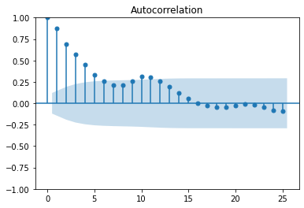

# Maximizing Returns: Time Series Forecasting for Optimal Real Estate Investments
## Table of contents

  - [Introduction](#introduction)
  - [Objectives](#objectives)
  - [Getting Started](#getting-started)
     - [Installation](#installation)
  - [Data Understanding](#data-understanding)
  - [EDA and Visualization](#eda-and-visualization)
  - [Modeling](#modeling)
  - [Evaluation](#evaluation)
  - [Conclusion](#conclusion)
  - [Recommendations](#recommendations)
  - [Next Steps](#next-steps)
## Introduction

Real investment firms weigh on many factors when deciding on which investment to make. These firms’ goals are to enhance their decision making processes. With historical real estate market data, the challenge is to leverage data science techniques to identify potential investment opportunities and helping the real estate firms in making informed investment decisions.  
A Real Estate Investment Firm wants to know the top 5 best zip codes to invest in. As a Data Science consulting group, we have been tasked with finding out.The task at hand is to create a model that will inform us on the Real Estate investment market trends for the next 10 years.

## Objectives
Main objectives:

* To optimize Investment Performance through Holistic Data-Driven Strategies

Secondary objectives:

* To select the 5 best zipcodes that offer best investment opportunities.
* To predict the value range for the top 5 zipcodes.

## Getting Started
Clone the repository:

git clone https://github.com/your-username/real-estate-analysis.git
Change to project directory:

cd real-estate-analysis

## Data Understanding
The dataset contains 14723 rows and 272 columns.    
Each of the row is a unique zipcode.    
The dataset as seen is in a Wide format. Columns 1-7 show the different properties of a house.    
However,  column 8 to column 272 are actual time series values. The columns refer to the median house sales values for their respective month and year.      
This format makes the dataframe intuitive and easy to read. However problems with this dataset may come in when it comes to actually learning from the data. We'll deal with that when we get there.   
The first 7 columns represent:
* RegionID - The Regional ID for the region where a house is located.
* RegionName - The Zipcode. 
* City - The City of a particular house. 
* State - The state in which a home is in. 
* Metro - The metropolitan area where the home is found. 
* CountyName - The county where the home is in. 
* SizeRank - The rank of a property's size relative to other properties in the dataset. 

### Choosing zipcodes
We will use Return On Investment (ROI) and Compound Annual Growth Rate (CAGR) as our metrics  to decide the best zipcodes.          
ROI measures the profitability while CAGR checks the variation.      
We will measure the best zipcodes for the last 10 years.    
We will do this by adding roi column and cagr column to calculate the return on investment and the cagr respectively for every zipcode.  

### EDA AND DATA VISUALIZATION.
We can check the states where these best 5 zipcodes are found

Our best zipcodes are found in only three states.           
There are two zipcodes from both CA and NY while PA has one zip code. 

#### Distribution of the Average Home Prices   

The observation of a bimodal distribution in the data implies the existence of two distinct peaks, indicating that the dataset is not unimodal or normally distributed. In the context of ZipCodes, this suggests the presence of two separate groups or subpopulations within the dataset, each characterized by its own set of home values. These distinct peaks may signify variations in housing characteristics, economic factors, or other influential variables that differentiate the two groups. Analyzing and understanding these subpopulations can be crucial for targeted decision-making, as it allows for a more nuanced exploration of factors influencing home values within different segments of the ZipCode.

#### Time Series  Plots

HDuring the period from 1996 to 2007, house prices experienced consistent growth. However, the market witnessed a substantial drop from 2007 to 2011, attributed to the profound impact of the housing market crisis in 2008 in the USA. Following the downturn, a subsequent recovery began, marked by a renewed uptrend in house prices, indicating a gradual stabilization and resilience in the real estate market.

#### Testing for Trends

The time series plot above provides a visual indication of a potential linear trend, suggesting a systematic pattern in the data over time. Linear trends can pose challenges for time series models that assume stationarity, as these trends imply a consistent directional movement. To assess the presence of trends more rigorously, a common approach is to employ rolling statistics. These statistical measures, calculated over moving windows, enable the detection of patterns and trends that may not be immediately evident in the overall time series plot. By testing for trends using rolling statistics, we gain a more granular understanding of the data dynamics, helping us make informed decisions about model assumptions and potential adjustments needed for accurate time series forecasting. 

The observation that the rolling mean is not stationary despite the rolling standard deviation being close to constant suggests that the data may exhibit a non-constant mean over time. Stationarity is a crucial assumption for many time series models, and its violation can impact the model's accuracy. To further assess stationarity, additional tests can be employed.      
By conducting these tests, we aim to gain more insights into the temporal behavior of the data and ascertain whether transformations or adjustments are needed to meet the stationarity requirement for effective time series modeling.

After differencing the data, observing that it is stationary at a 5% significance level implies that the transformation has effectively removed trends or patterns that rendered the original time series non-stationary. Differencing is a common technique used to stabilize the mean of a time series by subtracting the previous observation from the current one. Achieving stationarity at a 5% significance level means that the transformed data satisfies the criteria for constant mean and variance, enabling the application of various time series models. This result is significant as it validates the efficacy of the differencing process in making the data suitable for modeling, enhancing the accuracy of forecasting and analysis.

### AutoCorrelation Function
The autocorrelation function is a function that represents autocorrelation of a time series as a function of the time lag. 
ACF indicates how similar a value is within a given time series and the previous value. (OR) It measures the degree of the similarity between a given time series and the lagged version of that time series at the various intervals we observed

### Partial Autocorrelation Function

The observation that the high correlation ends at lag 2 in both the autocorrelation function (ACF) and partial autocorrelation function (PACF) is indicative of the potential order of an autoregressive model. The gradually decreasing ACF and the sudden drop in the PACF after lag 2 suggest that the time series may be best represented by an Autoregressive Model of order 2, denoted as AR(2). This means that the current value of the time series is linearly dependent on the two most recent observations. The absence of correlation beyond two lags suggests that the impact of earlier observations diminishes significantly, providing valuable information for model selection and forecasting accuracy. Understanding the lag structure is essential for choosing appropriate models and capturing the underlying patterns in the time series data.

### Train Test Splitting the Data
When evaluating a model, it's important to simulate how the model would perform on unseen data.            
Train-test splitting helps achieve this by creating a clear distinction between the data used for training and the data used for testing.

The validation approach employed here is a train-test split. The dataset (diffrenced) is divided into two subsets: a training set (train_set) and a test set (test_set). The purpose of this division is to train the model on a portion of the data and evaluate its performance on a separate, unseen subset.

# Modeling

### AUTOREGRESSIVE MODEL

This is when a value from a times series is regressed on previous values from the same series. 

This model gives us a RMSE of 102.09206.   and mae of 73.32           

on average, the model's predictions deviate by around 102 units from the actual values. While these metrics provide a quantitative assessment, a crucial consideration emerges when acknowledging that the model parameters were derived from the Partial Autocorrelation Function (PACF) and Autocorrelation Function (ACF) under the assumption of an AutoRegressive (AR) model. The lingering question arises: What if this assumption is incorrect? If the time series data exhibits features like seasonality or trend that are not adequately captured by the AR model, the model's efficacy may be compromised. This underscores the importance of scrutinizing model assumptions and exploring alternative approaches to ensure the selected model aligns accurately with the underlying dynamics of the data. 

We can use therefore try an auto arima model to get the best parameter, with seasonality included

### Auto Arima

AutoARIMA is an automated version of the ARIMA (AutoRegressive Integrated Moving Average) model selection process.             
It systematically explores different combinations of ARIMA hyperparameters (p, d, q) to find the model that best fits the given time series data.

The Root Mean Squared Error (RMSE) value of 108.77 and Mean Absolute Error (MAE) value of 82.55 serve as metrics to assess the accuracy of a predictive model. The RMSE quantifies the average magnitude of errors, with a lower value indicating better accuracy. In this instance, the model's predictions, on average, deviate by approximately 108.77 units from the actual values. Meanwhile, the MAE measures the average absolute difference between predicted and actual values, with a lower value signifying improved accuracy. The model's predictions, on average, exhibit an absolute error of around 82.55 units. These metrics collectively offer valuable insights into the model's precision and effectiveness in capturing underlying patterns in the data.

## Evaluation
Root Mean Squared Error (RMSE) is a common metric for evaluating the accuracy of models. It provides a measure of the average magnitude of the errors between predicted and actual values, and it is particularly sensitive to large errors. Lower RMSE values indicate better model performance, as it means the model's predictions are closer to the actual values.
Mean Absolute Error on the other hand takes the absolute values or the difference between the predicted and the actual figures. MAE is generally better at handling outliers and is easily interpretable.  
Our best model is the baseline model, Autogressive Model.
It has a RMSE of 102.09 and a MAE of 73,32. It performs as follows compared to the other models.

## Conclusion
In conclusion, the analysis underscores the potential for informed real estate investment decisions by leveraging predictive models. The identified zip codes and states present enticing opportunities, while the outlined next steps, including the exploration of advanced models and incorporation of additional datasets, offer pathways for further refinement. It's essential to approach the market with a recognition of inherent uncertainties and conduct thorough risk assessments. The dynamic nature of the real estate landscape necessitates continuous monitoring, iterative model improvement, and a collaborative mindset, engaging with industry experts and data scientists. This comprehensive approach aims to empower investors with the insights needed to navigate the evolving real estate market and make strategic decisions that align with both current trends and future opportunities.

## Recommendations

### Invest in Real Estate
A predicted ROI of 52.10% suggests a potentially lucrative investment opportunity in real estate. This positive return on investment indicates that, based on the model's projections, the investor stands to gain more than double the initial investment over the forecasted period. Such a robust ROI is indicative of the market's potential for appreciation and profit generation. However, it's essential for the investor to consider various factors, such as the level of risk tolerance, market volatility, and external economic conditions. Additionally, conducting a thorough analysis of the specific real estate market, including local trends, demand-supply dynamics, and regulatory factors, would provide a more comprehensive understanding before making investment decisions. While the predicted ROI is promising, a well-informed and cautious approach is advised for a successful and sustainable real estate investment strategy.  

#### The best zipcodes to invest in are:
* 15201
* 94043
* 11222
* 94301
* 11211
Based on the analysis, the recommended zip codes for real estate investment are 15201, 94043, 11222, 94301, and 11211.
These zip codes have shown favorable trends and promising returns according to the conducted analysis

#### The best states to invest are
* California
* New York
* Pennsylvania  
Additionally, the recommended states for real estate investment are California, New York, and Pennsylvania. These states exhibit positive indicators and economic factors that suggest potential growth and stability in the real estate market. Investors should consider these regions for their diverse opportunities and resilience in the housing sector. However, it's crucial to conduct thorough due diligence, monitor market dynamics, and stay informed about local factors influencing each specific investment area.

## Next Steps
1. **Explore Advanced Models:**
   - Consider implementing more advanced models such as Long Short-Term Memory (LSTM) networks to potentially enhance predictive performance.
   - Evaluate the suitability of LSTM for time series forecasting, as it can capture complex patterns and dependencies over time.
2. **Incorporate Additional Datasets:**
   - Expand the dataset by incorporating more features beyond the current variables.
   - Include datasets that encompass a broader range of economic indicators, demographic factors, or other relevant variables that could              influence real estate prices.
3. **Focus on Best Zip Codes:**
    - Direct efforts towards modeling and analyzing real estate prices specifically for the identified best-performing zip codes (e.g., 15201,         94043, 11222, 94301, 11211).
    - Tailor models to the unique characteristics and dynamics of these high-potential areas for more precise and targeted predictions.
.
4. **Iterative Model Refinement:**
    - Adopt an iterative approach to model refinement, incorporating feedback and insights from ongoing analysis.
    - Regularly update and adapt models based on the evolving real estate landscape and emerging trends